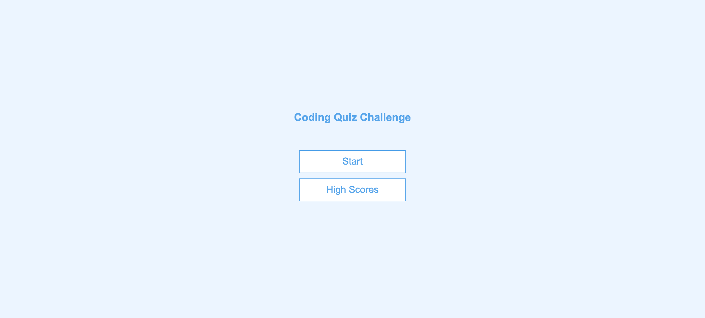
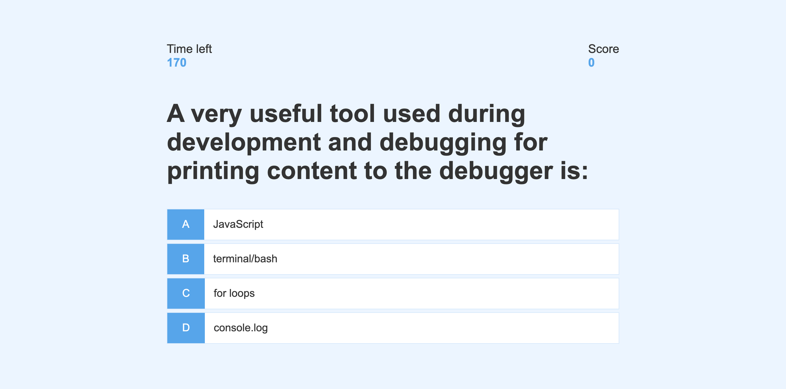

# Bootcamp Code Quiz Web App

## Purpose

Create a timed quiz on JavaScript fundamentals that stores high scores

## Steps to take

1. Create a home page and style it
1. Create a question page and style it 
1. Display hard-coded questions
1. Change the color for the answer selected based on it's correctness
1. Create a head's up display, with a timer and scorer, so that when a question is answered incorrectly, then time is subtracted by 10 seconds from the clock
1. Create an ending page where you can see and save your scores
1. Create the function to save the highest scores
1. Create a view to display the high scores
1. Create a remove function to remove the local storage of the highest scores

## Screenshot of the App

## Link to the Deployed App

[Deployed App](https://wangheer2010.github.io/Bootcamp-Code-Quiz-Web-App/)

## References

[James Q Quick](https://www.youtube.com/watch?v=DFhmNLKwwGw&list=PLDlWc9AfQBfZIkdVaOQXi1tizJeNJipEx&index=9)
